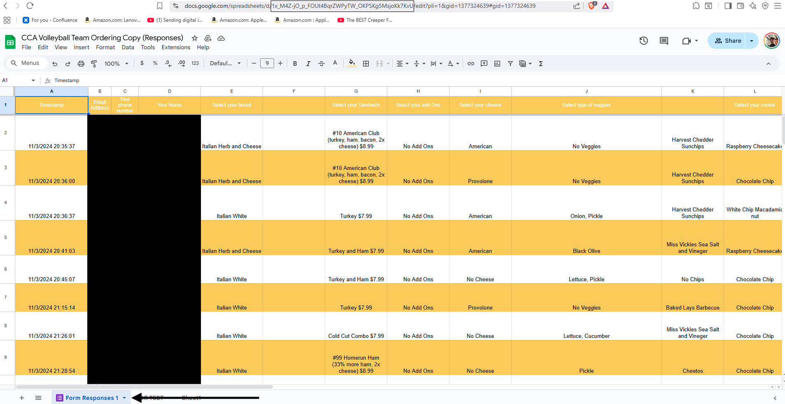
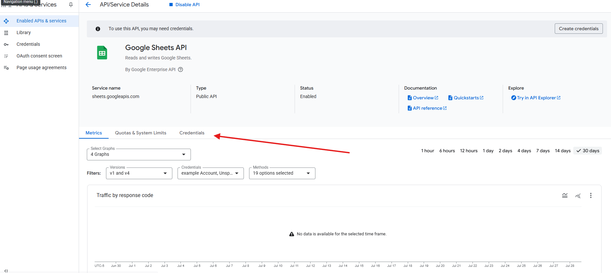
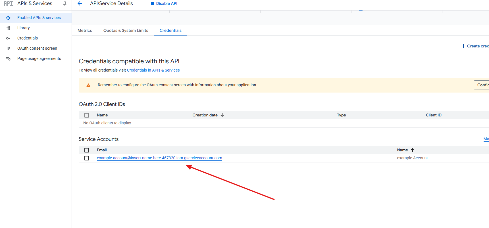
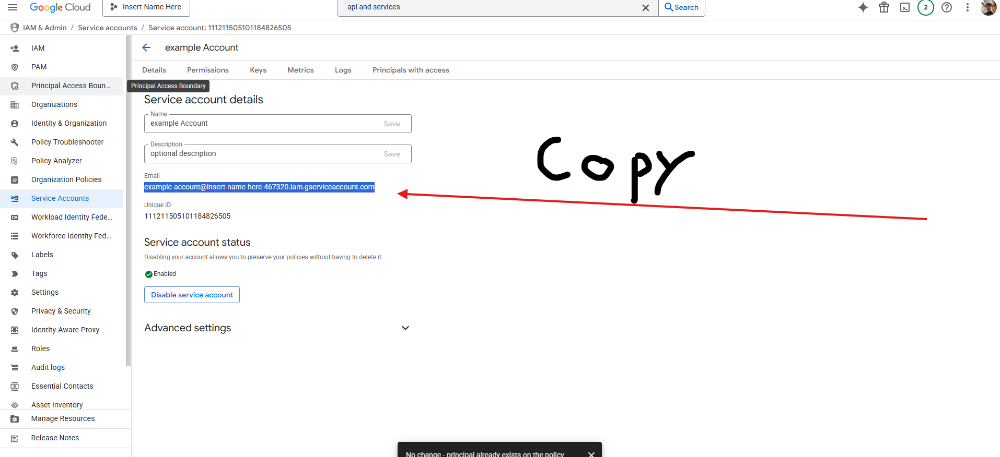
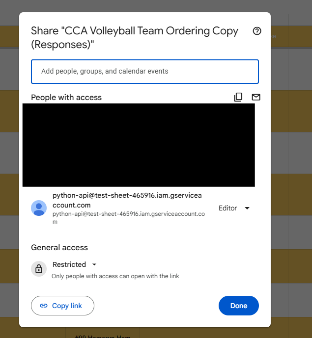
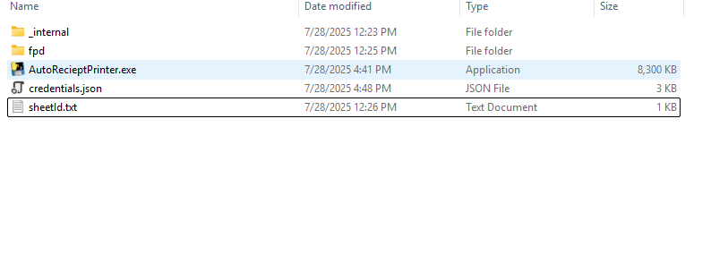
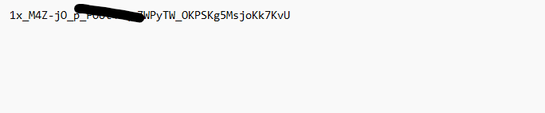

To change what sheet the program is connected to find the Sheet ID of the new sheet

The sheet ID can be found at in the URL between the d/ and the /edit
Make sure that the Sheet is named **Form Responses 1** 

You will need to get the and the account for the editor.

The sheet needs to be shared with the email you copied in the earlier step and labeled as an editor.

To have the format of the sheet be correct the order of the columns has to be the following:
Timestamp, email, phone, name, bread, footlong, sub, add_on, cheese, veggies, chips, cookie, drink, dressing, team, empty, empty, empty, empty, empty, empty, empty, empty, empty, empty, empty, empty, empty, empty, order_id, total_price, payment_status,  payable_method, payable_transaction_id, payable_last_updated
If there are settings you don't want leave them blank. Make sure Payment status is on column AF and there is something is column AI.

Find the folder of the Auto Receipt Printer C:\Program Files\Auto Receipt Printer, locate sheetId.txt and change the number inside it to be the one you grabbed from the URL.

