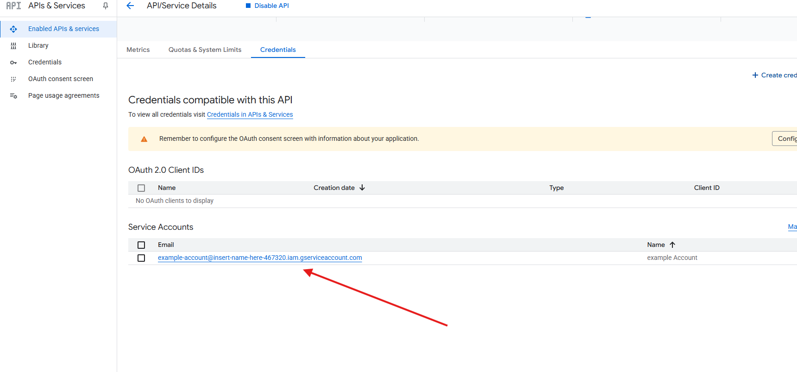
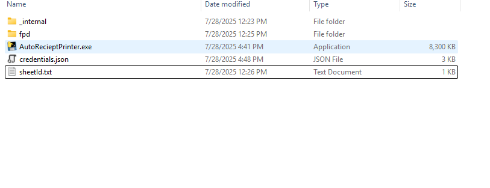
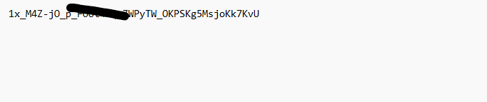

To get set up you need to have a google account that is set up to access the google sheet.

Primarily you need a google account. If you have multiple use one tied with the administrator. 

Go to https://console.cloud.google.com/ and sign in with that google account.

In the top left select the projects and create a new project.

If applicable this is where you would set it up to a organization.

To get your API key and information go to APIs and Services, Enable it and start Google Sheets API

Next you need to create credentials or the program to talk to. Create a set of credentials with editor access.

Click Next

Then hit Done.

You will need to get the API key and the account for the editor.

Save the JSON file to a place where you will remember it.

The next step will require the program to be started. It should start on boot but if it doesn't follow [Starting The Program](Starting The Program.md)

Go to the admin panel located at http://127.0.0.1:5000/ and upload the Key file.

To connect the correct sheet you will have to get the sheet ID and share it with the program. 

The sheet ID can be found at in the URL between the d/ and the /edit
Make sure that the Sheet is named **Form Responses 1** 

The sheet needs to be shared with the email you copied in the earlier step and labeled as an editor.

To have the format of the sheet be correct the order of the columns has to be the following:
Timestamp, email, phone, name, bread, footlong, sub, add_on, cheese, veggies, chips, cookie, drink, dressing, team, empty, empty, empty, empty, empty, empty, empty, empty, empty, empty, empty, empty, empty, empty, order_id, total_price, payment_status,  payable_method, payable_transaction_id, payable_last_updated
If there are settings you don't want leave them blank. Make sure Payment status is on column AF and there is something is column AI.

Find the folder of the Auto Receipt Printer C:\Program Files\Auto Receipt Printer, locate sheetId.txt and change the number inside it to be the one you grabbed from the URL.

