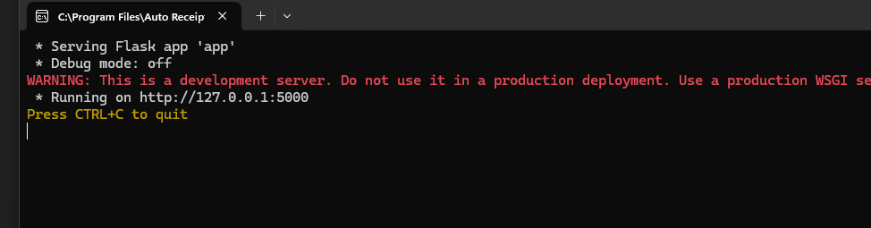

If there is no Command Prompt window in the background that looks like this:

Then your program has closed.

There are several ways to start the program. It should start automatically when the computer boots up, but in case it doesn't (or it gets closed), here's how to manually reopen it:

### 1\. **Command Prompt**

* Press 'Windows + S' and search for **CMD**, then open it.
* Type 'AutoReceiptPrinter' and hit **Enter**.

### 2\. **Use the Shortcut**

* On your **Desktop**, look for a shortcut called ‘AutoReceiptPrinter’.
* Double-click it.

### 3\. **Root File**

* Open the folder:  
  'C:\\Program Files\\Auto Receipt Printer'
* Double-click 'AutoReceiptPrinter.exe'.
